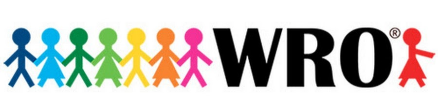
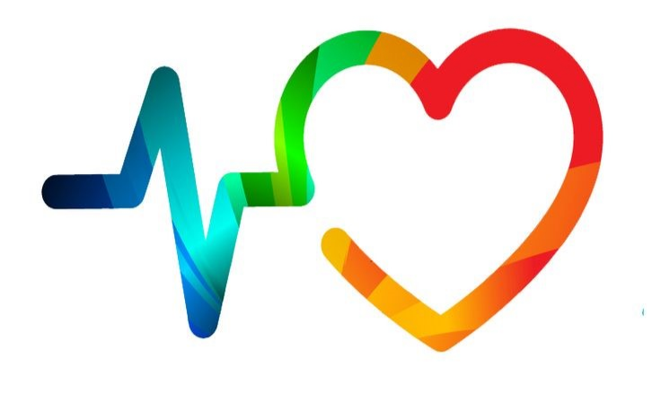
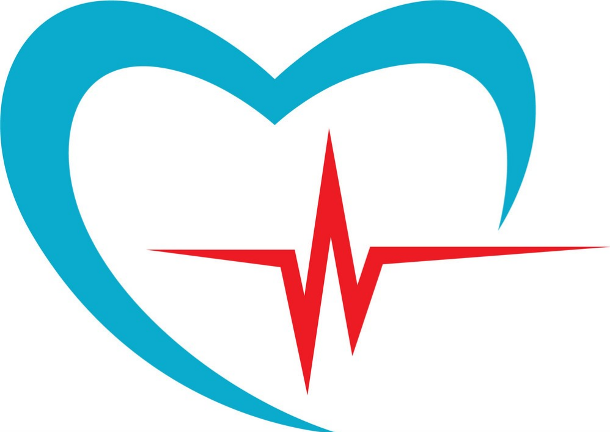
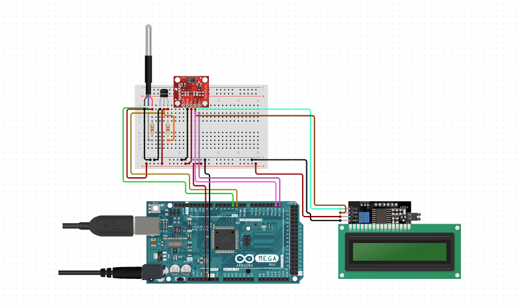

 __STEM FOUNDATION NEPAL__    _ _ 

 __	__    __\(WORLD ROBOT OLYMPIAD\) __ 

# PROJECT स्वस्थ जीवन

__Project Overview:__

__A multi\-functional robot designed to enhance patient care\.__

__Primary functions:__

__\- Medication delivery at prescribed intervals\.__

__\- Medical diagnostics as an ECG\, EMG\, Spirometer\, Oximeter\, pulse rate\, and temperature monitor\.__

__Generates comprehensive medical reports\.__

__Facilitates direct communication with a personal doctor for expert analysis\.__

__Key Benefits:__

__Improved patient care and well\-being\.__

__Streamlined healthcare processes\.__

__Enhanced doctor\-patient connection\.__

__Future\-ready healthcare technology\.__

 __WORKING OF THE PROJECT:__ 

 __Heartbeat Sensor \+ Thermometer \+ Display__ 

__Our ECG setup is designed for absolute user convenience\. With a simple process\, users need only follow the manual's guidance to place three color\-coded electrodes on their body as instructed\. Then\, they can sit back and relax while the scan completes\. The user is not just presented with real\-time results but also can access valuable historical comparison charts\, allowing for a deeper understanding of their health trends\.__

__The data collected by the sensor is seamlessly transferred to the nodemcu\, which ensures swift and secure transmission to the designated doctor's email\. This streamlined process enables the healthcare professional to promptly examine the data provided\, paving the way for timely actions\, especially when dealing with severe medical conditions\. This setup empowers individuals to monitor their health effortlessly while facilitating efficient communication with medical experts for better\, more informed healthcare decisions\.__

 __LOCOMOTION MECHANISM \+ INTERNET CONNECTION FOR DATA SHARING WITH THE DOCTOR \+ MEDICINE DELIVERY MECHANISM__ 

__Our innovative robot offers unparalleled control and precision through the convenience of your smartphone\, connected via the HC05 Bluetooth module\. With this connection\, you can effortlessly steer the robot\, optimizing its functionality and making it a seamless part of your healthcare routine\.__

__This intelligent machine is equipped to manage medication schedules\, ensuring that the right dosage is dispensed at precisely the right time\. It accomplishes this through the integration of an RTC module and servo motors\, guided by data supplied by the NodeMCU\.__

__To elevate its capabilities even further\, the robot can be upgraded to incorporate a Raspberry Pi\, replacing the NodeMCU\. This enhancement offers superior speed and reliability in transmitting data and controlling the robot\, resulting in a more advanced and efficient healthcare companion\.__

__This highly advanced robot is equipped with cutting\-edge capabilities that transcend traditional healthcare\. Harnessing the power of ultrasonic sensors\, it can navigate through obstacles with ease\, ensuring seamless and safe operation\. Powered by a long\-lasting battery\, it guarantees extended service without frequent recharging\. Notably\, this ingenious creation can delve into the intricacies of health diagnostics\, measuring lung capacity and air\-pressure through Spirometer assessments to identify potential lung issues\. Moreover\, it excels in monitoring vital signs\, including pulse rate and oxygen levels\, providing immediate insights into a person's well\-being\. Its versatility extends to temperature monitoring\, offering guidance on whether a medical checkup is advisable\, fostering proactive health management\. Beyond these feats\, it boasts the ability to assess muscle fitness using EMG electrodes\, making it an all\-encompassing\, futuristic healthcare solution\.__

__The project's comprehensive data management system ensures that all collected information is securely retained\.__

__This invaluable data can serve a dual purpose: it can be seamlessly transmitted to a patient's healthcare provider for immediate expert analysis\, promoting timely and informed medical decisions\. Simultaneously\, the data can be leveraged to create dynamic health comparison charts\, offering an insightful overview of an individual's health trends over time\.__

__This dual functionality not only fosters efficient healthcare communication but also empowers patients with the ability to monitor and understand their own well\-being with precision and clarity\.__

 __Positive Impacts of the Robot:__ 

__This innovative robot holds immense potential for transforming healthcare\. Its regular use could lead to a profound improvement in an individual's health\. By assuming multiple roles\, from medication delivery to comprehensive diagnostics\, it not only ensures timely and accurate treatments but also has the capability to diagnose critical conditions such as heart failure\, COVID\-19\, respiratory complications\, and muscular issues\, all within the comfort of one's own home\. This eliminates the need for arduous trips to complex testing facilities and the anxiety of waiting for test results\. In essence\, it empowers individuals to take control of their well\-being and promotes early intervention\, potentially saving lives and improving the overall quality of healthcare\.__

__This innovative system plays a pivotal role in proactively identifying and averting potential health complications\, significantly impacting both individual well\-being and financial considerations\. By offering a detailed technical assessment of the user's health\, this technology enables early detection and__  __ __  __prevention of issues\, enhancing the quality of life\.__

__Furthermore\, its efficiency and versatility eliminate the need for frequent\, costly checkups and periodic body scans\, representing a substantial cost\-saving measure in the long\-term management of one's health\. This comprehensive approach not only ensures optimal health but also optimizes healthcare expenditure\, making it a forward\-thinking solution for individuals and healthcare systems alike\.__

__Our innovative robot not only conducts medical tests but also transmits the collected data directly to a professional doctor via email\. This ensures the accuracy of results and minimizes doubts\. In the event of irregular test results\, patients are prompted to seek a comprehensive examination from a real doctor\, ensuring that any potential health issues are addressed promptly\.__

__Operating our robot is incredibly user\-friendly\, requiring minimal knowledge of its internal workings\.__

__Simply plug it into a socket for charging\, and follow the provided instructions\. Users and doctors can easily input medication prescriptions\, load the medicines into the robot's container\, and set the desired medication schedule\. The robot will then provide timely medication reminders\, ensuring a seamless and hassle\-free experience for both patients and medical professionals\.__

__It can also be bluetooth controlled for more efficiency and easiness\. __

__It could be the best\-of\-the\-friends because it will be helping you everyday by providing regular checkups and informing you about your health\.__

_TARGETED GROUP:_

__Our project is designed to benefit everyone\, regardless of their health status\, by providing regular health checkups for all\. However\, its primary focus is on individuals with heart or respiratory issues\, who require frequent monitoring but face challenges in visiting the doctor daily\.__

__We aim to bring accessible healthcare to the forefront\, ensuring that essential medical assessments and expert analysis are within reach for every individual\.__

_ROOM FOR IMPROVEMENT:_

__The potential for improving this robot is limitless\. With autonomous driving through Machine Learning\, powered by a Raspberry Pi microprocessor and Pi\-camera\, it can proactively seek patients and even send reminders for checkups\. While a BP sensor is unavailable in Nepal\, it's an option for further enhancement\. Beyond healthcare\, integrating basic chores into its functionality is an exciting prospect\.__

 __PRESENTER:__ 

 __NITESH GAUTAM__ 

 __IJSO 2019 BRONZE MEDALIST__ 

_THANK YOU\!_

