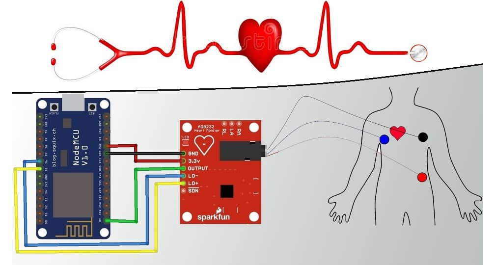
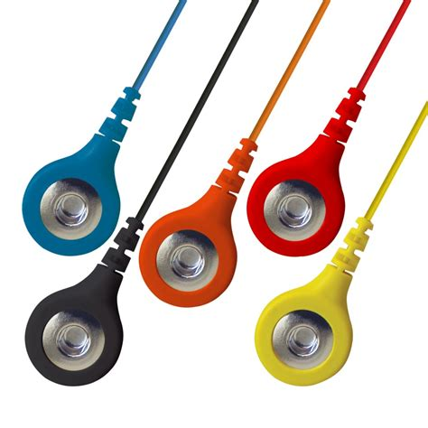
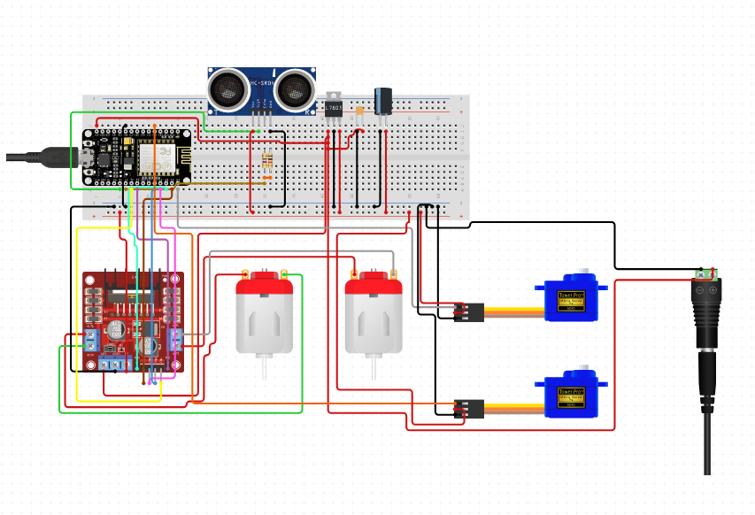

# STEM FOUNDATION NEPAL  
## WORLD ROBOT OLYMPIAD

# PROJECT: **स्वस्थ जीवन**  
_A Multi-Functional Robot Designed to Enhance Patient Care_

---

### Project Overview

Our robot is designed to streamline and improve patient care through a combination of advanced diagnostic tools and medication management systems.

**Primary Functions**:
- Medication delivery at prescribed intervals.
- Medical diagnostics using ECG, EMG, spirometer, oximeter, pulse rate, and temperature monitoring.
- Generates comprehensive medical reports.
- Facilitates direct communication with a personal doctor for expert analysis.

**Key Benefits**:
- Improved patient care and well-being.
- Streamlined healthcare processes.
- Enhanced doctor-patient communication.
- Future-ready healthcare technology.

---

### WORKING OF THE PROJECT

#### Heartbeat Sensor + Thermometer + Display

Our ECG setup is designed for user convenience. The user places three color-coded electrodes on their body as per the manual's instructions, and the scan completes automatically. The system provides real-time results, along with historical health trends, for deeper insights.

Data is seamlessly transferred to the NodeMCU, which sends it securely to the doctor's email. This allows healthcare professionals to promptly assess the data and respond to any critical conditions. The process empowers individuals to effortlessly monitor their health while ensuring timely expert consultation.

---

### LOCOMOTION MECHANISM + INTERNET CONNECTIVITY + MEDICATION DELIVERY

Our robot is controlled through a smartphone using the HC05 Bluetooth module, offering precise and intuitive control.

**Key Features**:
- **Medication Delivery**: Medication schedules are managed using an RTC module and servo motors, ensuring timely doses based on data provided by the NodeMCU.
- **Upgrades**: The NodeMCU can be replaced with a Raspberry Pi for enhanced speed, data transmission, and robot control.
- **Navigation**: Ultrasonic sensors enable obstacle detection, ensuring safe movement.
- **Diagnostics**: Measures lung capacity, air pressure, pulse rate, and oxygen levels. It can also perform muscle fitness assessments using EMG electrodes.

This robot can potentially diagnose critical health issues, including heart failure, respiratory complications, and muscle disorders. The collected data is securely stored and can be shared with healthcare providers or used to create health trend charts.

---

### POSITIVE IMPACTS

This robot holds immense potential in transforming healthcare, particularly for individuals requiring frequent monitoring for conditions such as heart disease, respiratory issues, or muscular complications. It eliminates the need for frequent visits to healthcare facilities by offering diagnostics in the comfort of the user's home.

**Impact Highlights**:
- **Early Diagnosis**: Detects potential health issues like COVID-19, heart problems, and more, promoting timely medical intervention.
- **Cost Efficiency**: Reduces the need for frequent, costly checkups and scans, saving time and money.
- **User Empowerment**: Allows individuals to monitor their own health and take control of their well-being.

The robot's data transmission ensures that doctors receive accurate and timely information, promoting better medical decisions. It also acts as a reminder system, prompting users to seek further medical attention if irregularities are detected.

---

### TARGETED GROUP

Our project benefits everyone by providing regular health checkups. However, it is particularly aimed at individuals with heart or respiratory issues who require frequent monitoring but struggle with daily doctor visits. We aim to make healthcare assessments and expert consultation accessible to all.

---

### ROOM FOR IMPROVEMENT

The potential for improvement is vast. Future enhancements could include:
- **Autonomous Navigation**: Using machine learning and a Raspberry Pi with a Pi-Camera, the robot could independently find patients and send checkup reminders.
- **BP Sensor Integration**: Although currently unavailable in Nepal, a blood pressure sensor could be added for more comprehensive health monitoring.
- **Chores Assistance**: Expanding functionality to include basic household chores would increase the robot’s utility.

---

### PRESENTER:  
**Nitesh Gautam**  
_IJSO 2019 Bronze Medalist_

---

Thank you!
